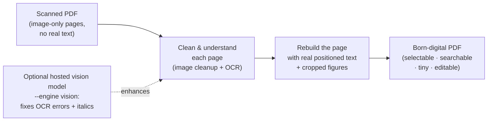
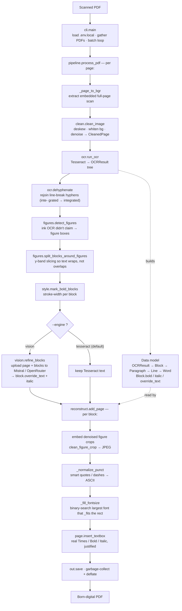

# pdfclean

Turn **scanned, image-only PDFs** into **clean, born-digital PDFs** — real
embedded text you can select, search and copy, with the full-page scan image
thrown away and only true figures re-embedded.

This is the aggressive "reconstruct from scratch" path: the output contains no
page photo, just positioned text + cropped illustrations. Files come out small
and editable. The trade-off is honesty about OCR — recognition mistakes appear
as real text, and layout is approximated rather than pixel-perfect.

## What it does, per page

1. **Extract** the embedded full-page scan at native resolution.
2. **Clean** — deskew, whiten the grey paper background, denoise/despeckle,
   sharpen text edges (`pdfclean/clean.py`).
3. **OCR with layout** — Tesseract gives every word a bounding box + confidence
   (`pdfclean/ocr.py`).
4. **Detect figures** — ink the OCR didn't claim as text becomes a figure
   candidate; slivers and speckle are filtered out. A text block that a figure
   cuts through is split into y-bands so the reflowed text wraps *around* the
   illustration instead of running over it (`pdfclean/figures.py`).
5. **Reconstruct** — a brand-new page. Each OCR *block* (a column of text) is
   re-flowed as real, wrapped, justified paragraphs in that block's rectangle.
   The font is grown to the **largest size that fills the block** (Times is
   narrower than the scan's face, so without this the column would be left
   half-empty), and line spacing is taken from the scan — so text size, density
   and the heading/body hierarchy track the original. Heavier-stroked blocks are
   rendered bold (`pdfclean/style.py`). Figures are denoised (non-local-means +
   white-point) and re-embedded as small JPEGs (`pdfclean/reconstruct.py`).

On the bundled sample (`assets/…silent-language….pdf`): 10 pages,
2.1 MB image-only scan → **0.31 MB** fully selectable PDF, ~6,900 words,
mean OCR confidence 95.

## How it works

### High level

The big picture: read a page of pixels, understand it, and rebuild it as real
text. The optional hosted vision model only makes the "understand" step more
accurate — the rest is unchanged.



### Low level

Every step, with the module/function that does it and the data it passes along.
The only fork is the OCR **engine**; everything after it is identical.



### Module map

| module | responsibility |
|--------|----------------|
| `pdfclean/cli.py` | argument parsing, `.env.local` loading, batch loop over files |
| `pdfclean/pipeline.py` | per-document orchestration: pulls each page's scan, runs the steps above, assembles the output PDF |
| `pdfclean/clean.py` | image cleanup — deskew, background whitening, denoise; also cleans figure crops |
| `pdfclean/ocr.py` | runs Tesseract, builds the `Block → Paragraph → Line → Word` tree with bounding boxes |
| `pdfclean/figures.py` | detects illustration regions and splits text blocks that a figure cuts through |
| `pdfclean/style.py` | per-block **bold** detection from stroke thickness |
| `pdfclean/vision.py` | optional hosted-model text correction + italic detection (`--engine vision`) |
| `pdfclean/reconstruct.py` | builds the new page: reflows each block's text to fill its rectangle, embeds figures |

### The data model

OCR produces a tree that every later step reads from. A page is a list of
**blocks** (≈ a column or a heading); each block holds **paragraphs → lines →
words**, and every word carries its pixel bounding box and confidence:

```
OCRResult
└── blocks: list[Block]            # one per column / heading, in reading order
    ├── bold / italic / override_text   # set by style.py / vision.py
    └── paragraphs: list[Paragraph]
        └── lines: list[Line]
            └── words: list[Word]  # text + (x, y, w, h) + confidence
```

`reconstruct.py` walks the blocks, takes each block's rectangle (the bounding box
of its words), and re-flows the block's text into it at the largest font that
fits — so the geometry comes from the scan but the glyphs are real, embedded
font text.

## Setup

```bash
conda env create -f environment.yml
conda activate pdf-ocr
```

## Usage

```bash
# batch a folder (recurses, mirrors structure into output/)
python -m pdfclean input/ -o output/

# a single file
python -m pdfclean scan.pdf -o output/        # -> output/scan.clean.pdf
```

### Options

| flag | default | meaning |
|------|---------|---------|
| `-o, --output` | (required) | output folder |
| `-l, --lang` | `eng` | Tesseract language(s), e.g. `eng+fra` |
| `--min-conf` | `40` | drop OCR words below this confidence |
| `--psm` | `3` | Tesseract page-segmentation mode |
| `--no-deskew` | off | skip skew correction |
| `--no-figures` | off | text only, don't re-embed figures |
| `--overwrite` | off | overwrite existing outputs |
| `--max-pages` | `0` (all) | only process the first N pages (cheap vision test) |
| `--engine` | `tesseract` | `tesseract` (local) or `vision` (hosted, see below) |
| `--provider` | `mistral` | vision provider: `mistral` or `openrouter` |
| `--model` | provider default | override the vision model |
| `--api-key` | env var | API key (else from `MISTRAL_API_KEY` / `OPENROUTER_API_KEY`) |

## Higher-accuracy OCR with a hosted vision model (optional)

Tesseract is local and free but makes mistakes (a script drop-cap *The* → junk,
an italic *in* → `mm`). `--engine vision` keeps the Tesseract **layout** (block
rectangles, font size, line pitch) but sends each page image to a hosted
multimodal model to **correct the text** and **detect italics**. No self-hosting.

Default provider is **Mistral** (free tier):

```bash
# 1. get a free key at https://console.mistral.ai  ->  API Keys
export MISTRAL_API_KEY=sk-...
#    ...or drop it in a gitignored .env.local (KEY=VALUE), auto-loaded by the CLI:
#    echo 'MISTRAL_API_KEY=sk-...' > .env.local

# 2. test on one page first (one API call), then run the whole thing
python -m pdfclean assets/ -o output/ --engine vision --max-pages 1
python -m pdfclean assets/ -o output/ --engine vision
```

Smart quotes / dashes the model returns are folded to ASCII so they render in the
base-14 font (no `?` boxes, files stay tiny).

Or use **OpenRouter**'s free vision models:

```bash
export OPENROUTER_API_KEY=sk-or-...
python -m pdfclean assets/ -o output/ --engine vision --provider openrouter
```

If a page's API call fails (rate limit, network), that page silently falls back
to the Tesseract text so the batch still completes.

> **Privacy:** with `--engine vision`, each page image is uploaded to the chosen
> provider. Don't use it on confidential scans unless that's acceptable. The
> default `--engine tesseract` is fully local.

## Known limits & upgrade paths

- **OCR errors are visible** with the default local engine (e.g. an italic *in*
  read as `mm`, a decorative drop-cap *The* read as junk). Use `--engine vision`
  (above) to fix most of these and recover italics.
- **Layout is approximated, not pixel-perfect** — text is re-flowed per column
  block, so line breaks and vertical positions differ slightly from the original.
  This is deliberate: readability is prioritised over exact placement.
- **Italics:** detected by the `vision` engine; with the local `tesseract`
  engine italic type is rendered upright (bold is still detected via stroke
  weight). Local slant detection was too noisy to ship safely.
- **Figures are grayscale.** Fine for line art; a `--color-figures` flag could
  preserve colour photos.
